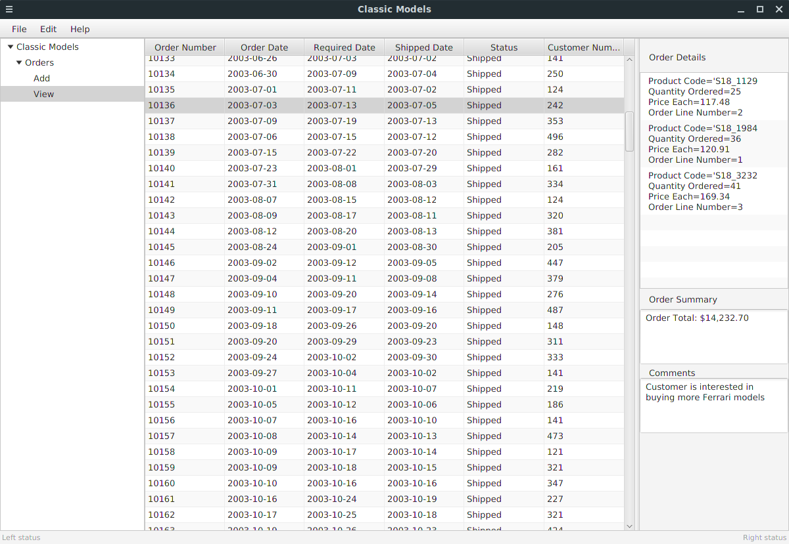

# Classic Models GUI

An MVC style JavaFX application for order management. Built on top of the classic models database avaliable [here](http://www.mysqltutorial.org/mysql-sample-database.aspx).

### Prerequisites

The application is configured to run on an Azure MySQL database. You will need to provide your own connection paramaters in a connection.properties file.

## Status

Work in progress.

## GUI

## Built With

* [Java 11](https://www.oracle.com/technetwork/java/javase/downloads/jdk11-downloads-5066655.html)
* [JavaFX](https://openjfx.io/) - GUI

## Authors

* **Andrew Moss** - *Creator* - [agmoss](https://github.com/agmoss)

## License

This project is licensed under the MIT License - see the [LICENSE.md](LICENSE.md) file for details

